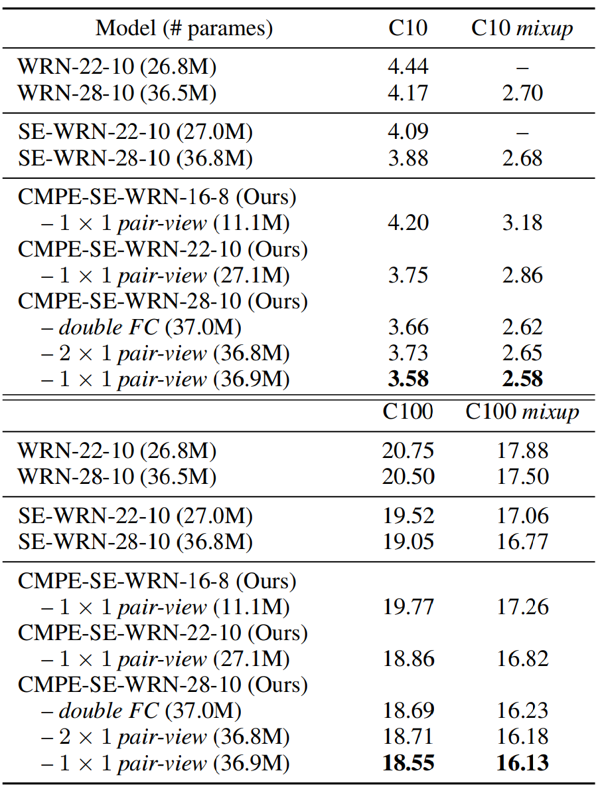

# CompetitiveSENet
---

Source code of paper: 

   **Competitive Inner-Imaging Squeeze and Excitation for Residual Network** ([https://arxiv.org/abs/1807.08920](https://arxiv.org/abs/1807.08920))

---
## Architecture

|Competitive Squeeze-Exciation Architecutre for Residual block|
|-|
||

---

SE-ResNet module and CMPE-SE-ResNet modules:

|Normal SE|Double FC squeezes|Conv 2x1 pair-view|Conv 1x1 pair-view|
|-|-|-|-|
|||||

## Requirements

- mxnet.gluon

## Results
Best record of this novel model on CIFAR-10 and CIFAR-100 (used "*mixup*" ([https://arxiv.org/abs/1710.09412](https://arxiv.org/abs/1710.09412))) can achieve: **97.55%** and **84.38%**.

Error rates(%) of Wide Residual Networks and pre-act ResNets on CIFAR10/100:

|WRN|Resnet|
|-|-|
|||

More results can be found in our paper: [arXiv paper: Competitive Inner-Imaging Squeeze and Excitation for Residual Network](https://arxiv.org/abs/1807.08920)

## Notes:
The result of our best model in Kaggle competition : [CIFAR-10 - Object Recognition in Images](https://www.kaggle.com/c/cifar-10) 

