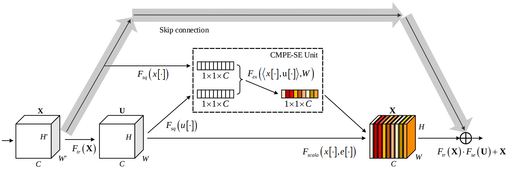

# CompetitiveSENet
---

Source code of paper: **Competitive Inner-Imaging Squeeze and Excitation for Residual Network** ([https://arxiv.org/abs/1807.08920](https://arxiv.org/abs/1807.08920))

---
## Architecture

## Requirements

- mxnet.gluon

## Results
Best record of this novel model on CIFAR-10 and CIFAR-100 (used "*mixup*" ([https://arxiv.org/abs/1710.09412](https://arxiv.org/abs/1807.08920))) can achieve: **97.55%** and **84.38%**.

## Notes:
The competition of [CIFAR-10 - Object Recognition in Images](https://www.kaggle.com/c/cifar-10) in Kaggle: 

